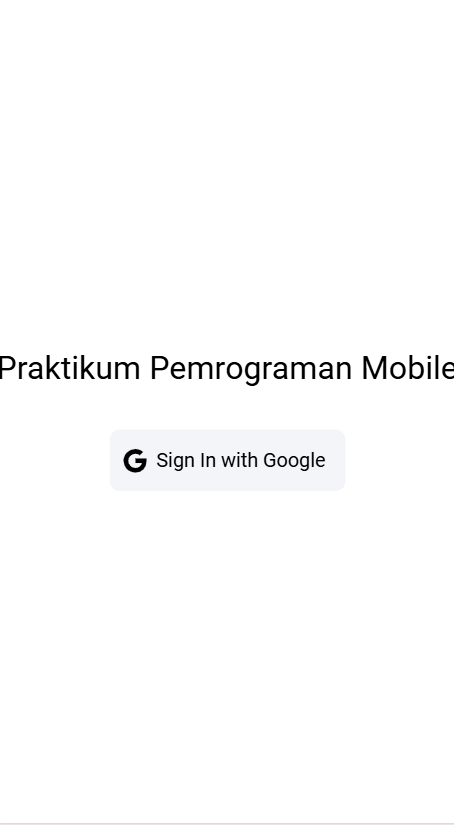
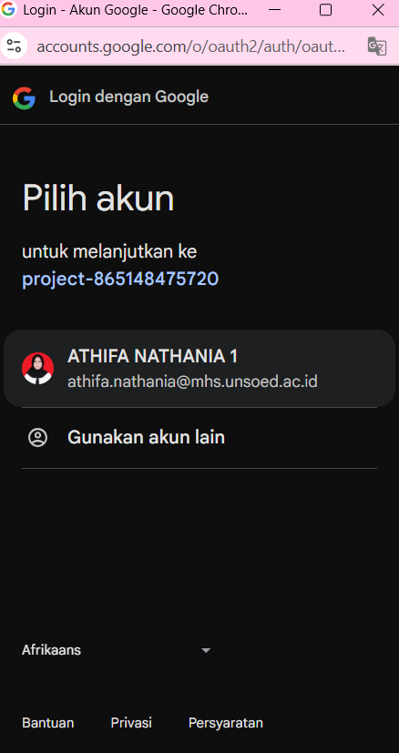
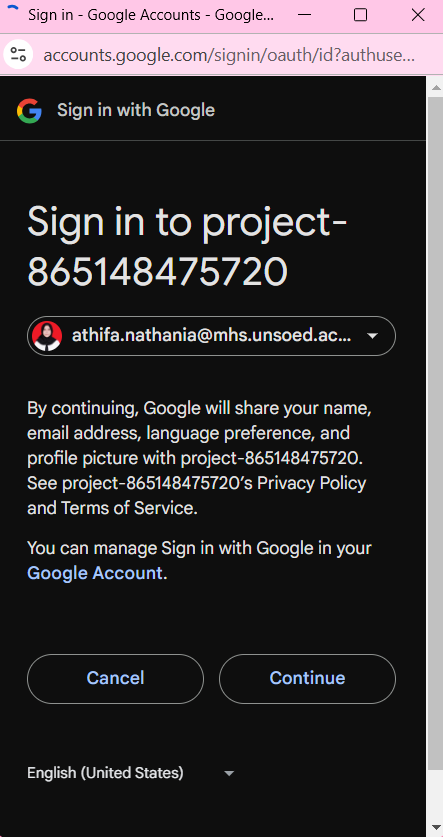
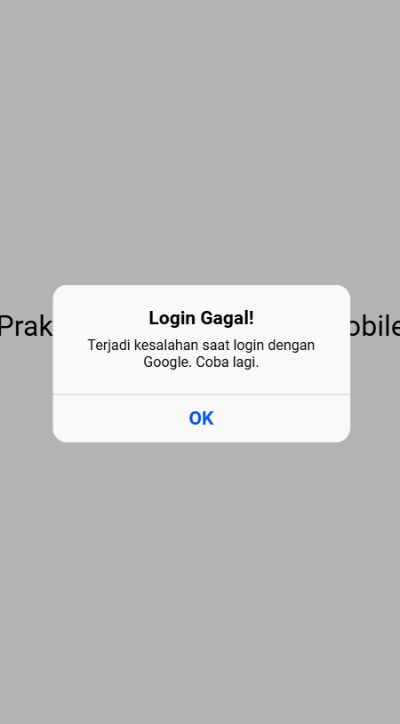
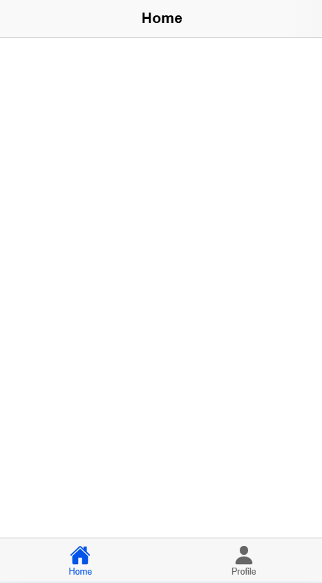
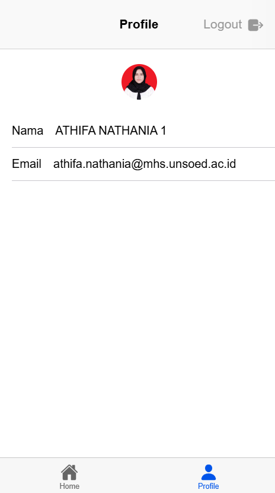

#### Nama       : Athifa Nathania  
#### NIM        : H1D022031  
#### Shift Baru : F
#### Shift Lama : D

---
# Tugas 9 - Cara Kerja Autentikasi Login

### **1. Login Page**

  

Menampilkan halaman awal aplikasi di mana terdapat tombol *Sign In with Google*.

#### **Penjelasan:**
- **Kode:**  
  ```vue
  <ion-button @click="login" color="light">
      <ion-icon slot="start" :icon="logoGoogle"></ion-icon>
      <ion-label>Sign In with Google</ion-label>
  </ion-button>
  ```
- Tombol ini memanggil fungsi `login` yang menjalankan proses autentikasi melalui Google menggunakan Firebase.

---

### **2. Proses Autentikasi Google**

  

#### **Penjelasan:**
- **Kode:**  
  ```typescript
  const loginWithGoogle = async () => {
      try {
          await GoogleAuth.initialize({
              clientId: '865148475720-...',
              scopes: ['profile', 'email'],
              grantOfflineAccess: true,
          });

          const googleUser = await GoogleAuth.signIn();
          const idToken = googleUser.authentication.idToken;

          const credential = GoogleAuthProvider.credential(idToken);
          const result = await signInWithCredential(auth, credential);

          user.value = result.user;
          router.push("/home");
      } catch (error) {
          console.error("Google sign-in error:", error);
          ...
      }
  };
  ```
- **Langkah-langkah proses login:**
  1. **Inisialisasi Google Auth:**  
     Firebase Auth dan plugin Google Auth Capacitor diinisialisasi dengan `GoogleAuth.initialize`, menggunakan `clientId` dari Firebase.
  2. **Sign In Google:**  
     Pemanggilan `GoogleAuth.signIn()` membuka halaman login Google untuk otentikasi.
  3. **Ambil Token ID:**  
     Setelah pengguna berhasil login, `googleUser.authentication.idToken` diperoleh.
  4. **Generate Credential:**  
     Token ID ini diubah menjadi *credential* Firebase melalui `GoogleAuthProvider.credential(idToken)`.
  5. **Autentikasi Firebase:**  
     *Credential* dikirim ke Firebase melalui `signInWithCredential(auth, credential)`, yang menghasilkan data pengguna lengkap (username, email, foto profil, dll.).
  6. **Navigasi ke Home:**  
     Jika sukses, pengguna diarahkan ke halaman *Home* dengan `router.push("/home")`.

---

### **3. Jika Login Gagal**



#### **Penjelasan:**
- **Kode:**
  ```typescript
  const alert = await alertController.create({
      header: 'Login Gagal!',
      message: 'Terjadi kesalahan saat login dengan Google. Coba lagi.',
      buttons: ['OK'],
  });
  await alert.present();
  ```
- Jika terjadi kesalahan (contoh: token invalid atau koneksi internet bermasalah), akan muncul *alert* dengan pesan error.

---

### **4. Home Page**


#### **Penjelasan:**
- Setelah login berhasil, pengguna diarahkan ke halaman *Home* yang memiliki navigasi ke halaman lain.

---

### **5. Profil Page (Tampilkan Foto Profil)**


#### **Penjelasan:**
- **Kode untuk foto profil:**
  ```typescript
  const userPhoto = ref(user.value?.photoURL || 'https://ionicframework.com/docs/img/demos/avatar.svg');

  function handleImageError() {
      userPhoto.value = 'https://ionicframework.com/docs/img/demos/avatar.svg';
  }
  ```
  - Variabel `userPhoto` diisi URL foto profil Google pengguna. Jika foto gagal dimuat, digunakan *placeholder* default.

- **Struktur HTML:**
  ```vue
  <ion-avatar>
      
  </ion-avatar>
  ```
  - Foto profil ditampilkan menggunakan elemen `<ion-avatar>`.

---

### **6. Logout**

Untuk logout dari aplikasi, kita perlu menghapus sesi pengguna yang sudah login melalui Firebase. 

#### **Penjelasan:**
- **Proses logout:**
  1. Pengguna menekan tombol *Logout*.
  2. Fungsi `signOut()` dari Firebase dipanggil untuk menghapus sesi autentikasi pengguna.
  3. Setelah berhasil logout, pengguna diarahkan kembali ke halaman login atau halaman lainnya sesuai kebutuhan aplikasi.

#### **Kode:**
```typescript
import { signOut } from "firebase/auth";
import { auth } from "@/firebase";  // Impor instance auth Firebase

const logout = async () => {
  try {
    await signOut(auth);
    console.log("Berhasil Logout");
    router.push("/login");  // Arahkan ke halaman login setelah logout
  } catch (error) {
    console.error("Logout gagal", error);
  }
};
```

#### **Struktur HTML Tombol Logout:**
```vue
<ion-button @click="logout" color="danger">Logout</ion-button>
```

- Fungsi `signOut(auth)` akan menghapus sesi pengguna dari Firebase, sehingga pengguna tidak lagi terautentikasi. 
- Setelah logout berhasil, pengguna akan diarahkan ke halaman login menggunakan `router.push("/login")`.

