#### Nama       : Athifa Nathania  
#### NIM        : H1D022031  
#### Shift Baru : F
#### Shift Lama : D

---
# Tugas 9 - Cara Kerja Autentikasi Login

### **1. Login Page**

  

Menampilkan halaman awal aplikasi di mana terdapat tombol *Sign In with Google*.

#### **Penjelasan:**
- **Kode:**  
  ```vue
  <ion-button @click="login" color="light">
      <ion-icon slot="start" :icon="logoGoogle"></ion-icon>
      <ion-label>Sign In with Google</ion-label>
  </ion-button>
  ```
- Tombol ini memanggil fungsi `login` yang menjalankan proses autentikasi melalui Google menggunakan Firebase.

---

### **2. Proses Autentikasi Google**

  

#### **Penjelasan:**
- **Kode:**  
  ```typescript
  const loginWithGoogle = async () => {
      try {
          await GoogleAuth.initialize({
              clientId: '865148475720-...',
              scopes: ['profile', 'email'],
              grantOfflineAccess: true,
          });

          const googleUser = await GoogleAuth.signIn();
          const idToken = googleUser.authentication.idToken;

          const credential = GoogleAuthProvider.credential(idToken);
          const result = await signInWithCredential(auth, credential);

          user.value = result.user;
          router.push("/home");
      } catch (error) {
          console.error("Google sign-in error:", error);
          ...
      }
  };
  ```
- **Langkah-langkah proses login:**
  1. **Inisialisasi Google Auth:**  
     Firebase Auth dan plugin Google Auth Capacitor diinisialisasi dengan `GoogleAuth.initialize`, menggunakan `clientId` dari Firebase.
  2. **Sign In Google:**  
     Pemanggilan `GoogleAuth.signIn()` membuka halaman login Google untuk otentikasi.
  3. **Ambil Token ID:**  
     Setelah pengguna berhasil login, `googleUser.authentication.idToken` diperoleh.
  4. **Generate Credential:**  
     Token ID ini diubah menjadi *credential* Firebase melalui `GoogleAuthProvider.credential(idToken)`.
  5. **Autentikasi Firebase:**  
     *Credential* dikirim ke Firebase melalui `signInWithCredential(auth, credential)`, yang menghasilkan data pengguna lengkap (username, email, foto profil, dll.).
  6. **Navigasi ke Home:**  
     Jika sukses, pengguna diarahkan ke halaman *Home* dengan `router.push("/home")`.

---

### **3. Jika Login Gagal**


#### **Penjelasan:**
- **Kode:**
  ```typescript
  const alert = await alertController.create({
      header: 'Login Gagal!',
      message: 'Terjadi kesalahan saat login dengan Google. Coba lagi.',
      buttons: ['OK'],
  });
  await alert.present();
  ```
- Jika terjadi kesalahan (contoh: token invalid atau koneksi internet bermasalah), akan muncul *alert* dengan pesan error.

---

### **4. Home Page**


#### **Penjelasan:**
- Setelah login berhasil, pengguna diarahkan ke halaman *Home* yang memiliki navigasi ke halaman lain.

---

### **5. Profil Page (Tampilkan Foto Profil)**


#### **Penjelasan:**
- **Kode untuk foto profil:**
  ```typescript
  const userPhoto = ref(user.value?.photoURL || 'https://ionicframework.com/docs/img/demos/avatar.svg');

  function handleImageError() {
      userPhoto.value = 'https://ionicframework.com/docs/img/demos/avatar.svg';
  }
  ```
  - Variabel `userPhoto` diisi URL foto profil Google pengguna. Jika foto gagal dimuat, digunakan *placeholder* default.

- **Struktur HTML:**
  ```vue
  <ion-avatar>
      
  </ion-avatar>
  ```
  - Foto profil ditampilkan menggunakan elemen `<ion-avatar>`.

---

### **6. Logout**

Untuk logout dari aplikasi, kita perlu menghapus sesi pengguna yang sudah login melalui Firebase. 

#### **Penjelasan:**
- **Proses logout:**
  1. Pengguna menekan tombol *Logout*.
  2. Fungsi `signOut()` dari Firebase dipanggil untuk menghapus sesi autentikasi pengguna.
  3. Setelah berhasil logout, pengguna diarahkan kembali ke halaman login atau halaman lainnya sesuai kebutuhan aplikasi.

#### **Kode:**
```typescript
import { signOut } from "firebase/auth";
import { auth } from "@/firebase";  // Impor instance auth Firebase

const logout = async () => {
  try {
    await signOut(auth);
    console.log("Berhasil Logout");
    router.push("/login");  // Arahkan ke halaman login setelah logout
  } catch (error) {
    console.error("Logout gagal", error);
  }
};
```

#### **Struktur HTML Tombol Logout:**
```vue
<ion-button @click="logout" color="danger">Logout</ion-button>
```

- Fungsi `signOut(auth)` akan menghapus sesi pengguna dari Firebase, sehingga pengguna tidak lagi terautentikasi. 
- Setelah logout berhasil, pengguna akan diarahkan ke halaman login menggunakan `router.push("/login")`.


---
#### Nama       : Athifa Nathania  
#### NIM        : H1D022031  
#### Shift Baru : F
#### Shift Lama : D

---
# Tugas 10 - Proses CRUD Todo

## Deskripsi Proyek
Aplikasi ini adalah platform manajemen tugas berbasis Ionic, Vue.js, dan Firebase Firestore. Dengan aplikasi ini, pengguna dapat melakukan autentikasi menggunakan akun Google, mengelola tugas melalui proses CRUD (Create, Read, Update, Delete), dan mengubah status tugas menjadi selesai atau aktif. Selain itu, aplikasi ini dirancang untuk memudahkan pengembang membangun file APK langsung dari VS Code dengan memanfaatkan Android SDK, tanpa memerlukan Android Studio.

## Fitur Utama
1. **Autentikasi Google**: Login menggunakan akun Google untuk keamanan dan kemudahan akses.
2. **CRUD Tugas**: Menyediakan fitur untuk menambah, membaca, memperbarui, dan menghapus tugas.
3. **Manajemen Status**: Memungkinkan pengguna menandai tugas sebagai "selesai" atau mengembalikannya ke status "aktif".

---

## 1. Read
### Tampilan Daftar Tugas
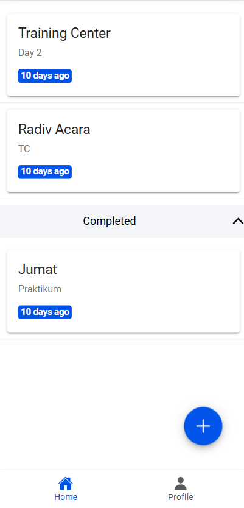  
**Penjelasan:** Semua tugas yang ada diambil dari Firestore ketika halaman dimuat menggunakan fungsi `loadTodos()`. Data dibedakan menjadi dua kategori, yaitu **Active Todos** dan **Completed Todos**, berdasarkan status masing-masing tugas, yang ditampilkan menggunakan komponen IonList.

---

## 2. Create
### a. Membuat Tugas Baru
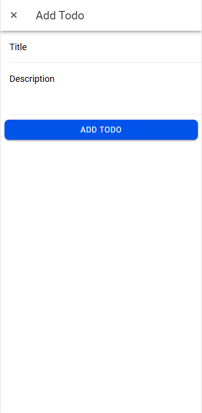  
**Penjelasan:** Pengguna dapat menambahkan tugas baru dengan mengisi formulir yang terdiri dari kolom **Title** dan **Description**. Tombol "+" membuka modal `InputModal` untuk memasukkan data.

### b. Konfirmasi Penambahan
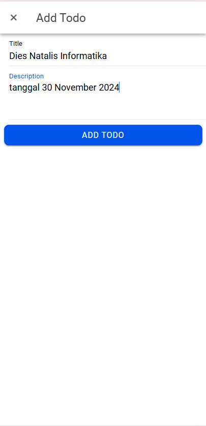  
**Penjelasan:** Setelah pengguna mengisi data, formulir akan mengirimkan informasi tugas baru ke Firebase melalui fungsi `handleSubmit`. Jika berhasil, akan muncul notifikasi bahwa tugas telah ditambahkan.

### c. Tampilan Daftar Setelah Penambahan
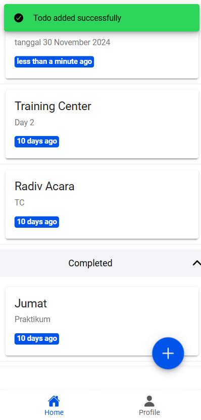  
**Penjelasan:** Daftar tugas diperbarui dengan menampilkan tugas baru yang telah berhasil ditambahkan.

---

## 3. Update
### a. Mengedit Informasi Tugas
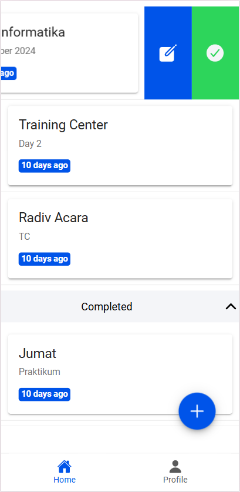  
**Penjelasan:** Pengguna dapat memperbarui informasi tugas yang sudah ada dengan menekan tombol edit. Data yang dipilih akan ditampilkan di modal `InputModal` untuk diedit.

### b. Konfirmasi Pengeditan
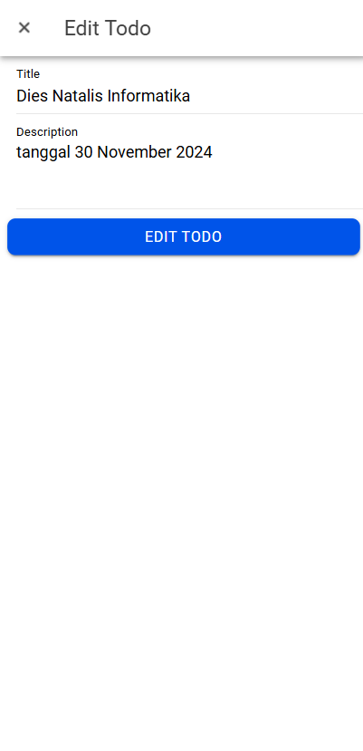  
**Penjelasan:** Setelah data dimasukkan, pengguna dapat menyimpan perubahan. Fungsi `firestoreService.updateTodo` digunakan untuk memperbarui data di Firestore.

### c. Tampilan Setelah Penyimpanan
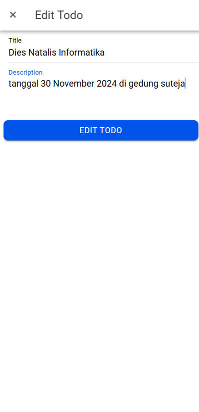  
**Penjelasan:** Setelah berhasil, daftar tugas diperbarui dengan menampilkan informasi terbaru dari tugas yang telah diubah.

  
**Penjelasan:** Tugas yang telah diedit ditampilkan dalam daftar dengan detail yang telah diperbarui.

---

### b. Mengubah Status Tugas
#### Mark Complete
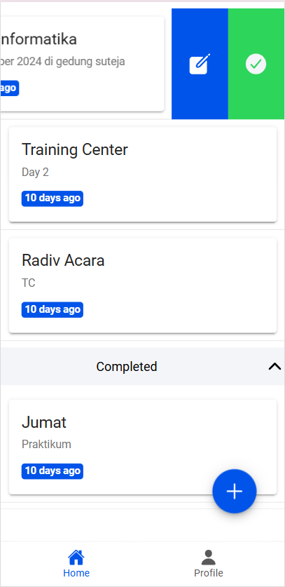  
**Penjelasan:** Tugas dapat ditandai sebagai selesai dengan menekan tombol checkmark atau menggeser item. Fungsi `firestoreService.updateStatus` akan memperbarui status tugas di Firestore.

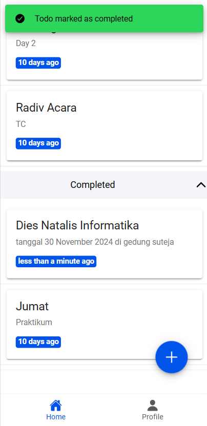  
**Penjelasan:** Setelah status diperbarui menjadi "completed", tugas dipindahkan ke bagian daftar tugas selesai.

#### Mark Active
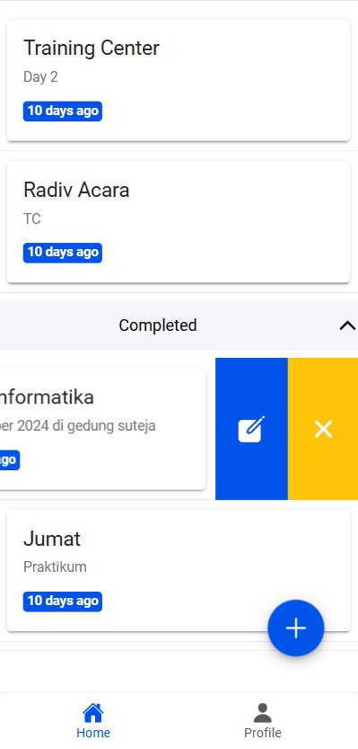  
**Penjelasan:** Tugas yang telah selesai dapat diaktifkan kembali dengan cara yang sama. Fungsi `firestoreService.updateStatus` akan mengubah status menjadi "active".

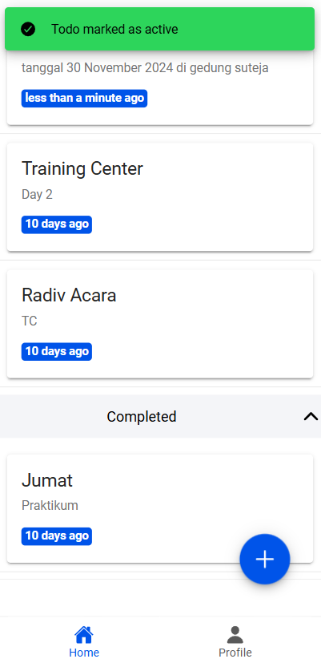  
**Penjelasan:** Tugas yang diaktifkan kembali ditampilkan di daftar tugas aktif.

---

## 4. Delete
### Menghapus Tugas
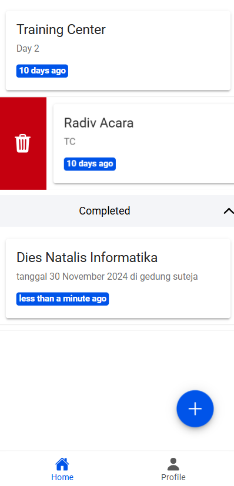  
**Penjelasan:** Pengguna dapat menghapus tugas dengan menekan tombol delete atau menggeser tugas ke kiri. Fungsi `firestoreService.deleteTodo` digunakan untuk menghapus data dari Firestore.

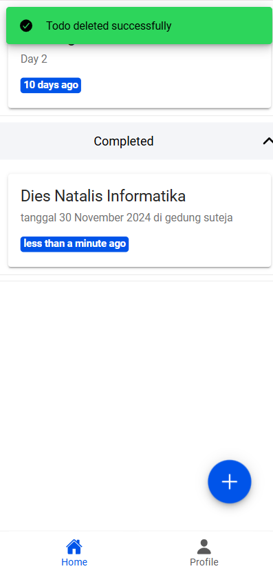  
**Penjelasan:** Setelah tugas berhasil dihapus, daftar diperbarui untuk hanya menampilkan tugas yang tersisa.

---

## Demo Aplikasi
1. **Halaman Awal**: Menampilkan daftar tugas sebelum data baru ditambahkan.
2. **Menambahkan Tugas**: Pengguna dapat menambahkan tugas baru dengan mengisi formulir.
3. **Daftar Tugas Baru**: Setelah tugas berhasil ditambahkan, daftar diperbarui secara otomatis.
4. **Menandai Tugas Selesai**: Tugas yang selesai dapat ditandai, dan akan dipindahkan ke daftar tugas selesai.
5. **Mengedit Tugas**: Pengguna dapat memperbarui informasi tugas yang telah dibuat.
6. **Menghapus Tugas**: Tugas yang tidak diperlukan lagi dapat dihapus, dan daftar akan diperbarui.

---


